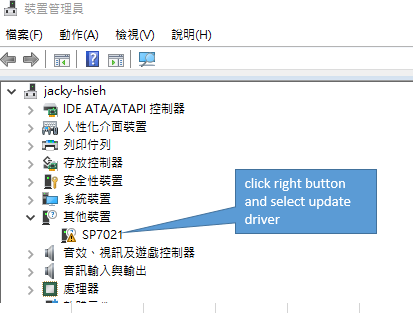
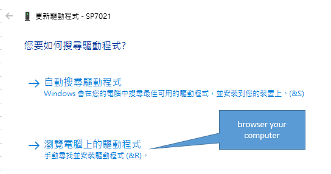
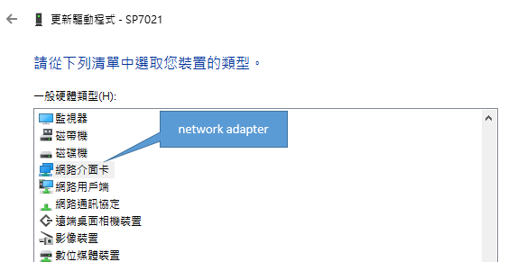
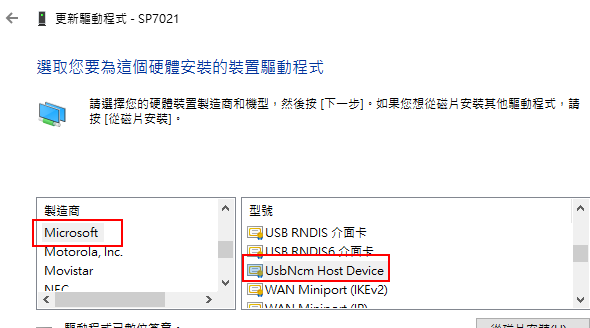
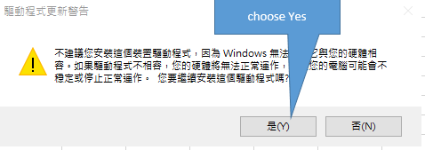
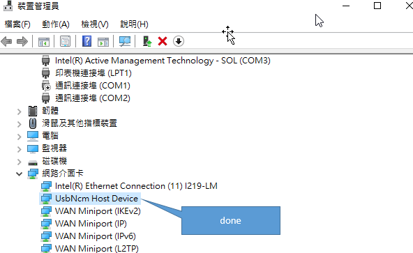
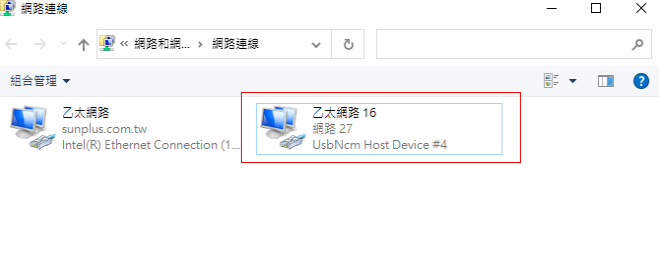
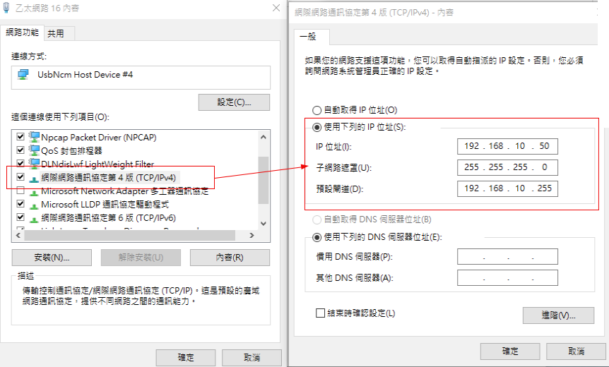
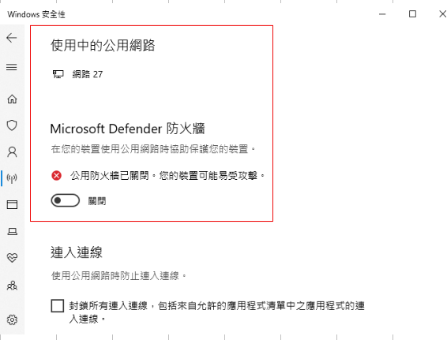

# How to enable USB gadget
1. If source code isn't compiled with gadget configs, please refer to [How to compile](https://github.com/sunplus-plus1/SP7021)
>**Note: You can using kconfig or following command line to set USB gadget before make:
```bash
cat <<EOT >> gadget_config
#
# USB Physical Layer drivers
#
CONFIG_USB_GADGET=y
CONFIG_U_SERIAL_CONSOLE=y
CONFIG_SUNPLUS_USB_PHY=y
CONFIG_USB_SUNPLUS_OTG=y
CONFIG_GADGET_USB0=y
CONFIG_USB_GADGET_VBUS_DRAW=2
CONFIG_USB_GADGET_STORAGE_NUM_BUFFERS=2
#
# USB Peripheral Controller
#
CONFIG_USB_GADGET_SUNPLUS=y
CONFIG_USB_LIBCOMPOSITE=m
CONFIG_USB_F_SS_LB=m
CONFIG_USB_U_ETHER=m
CONFIG_USB_F_NCM=m
CONFIG_USB_F_ECM=m
CONFIG_USB_F_SUBSET=m
CONFIG_USB_F_RNDIS=m
CONFIG_USB_F_MASS_STORAGE=m
CONFIG_USB_F_ACM=m
CONFIG_USB_F_SERIAL=m
CONFIG_USB_CONFIGFS=m
CONFIG_USB_CONFIGFS_NCM=y
CONFIG_USB_CONFIGFS_ECM=y
CONFIG_USB_CONFIGFS_RNDIS=y
CONFIG_USB_CONFIGFS_MASS_STORAGE=y
CONFIG_USB_U_SERIAL=m
CONFIG_USB_ZERO=m
CONFIG_USB_ETH=m
CONFIG_USB_ETH_RNDIS=y
CONFIG_USB_G_NCM=m
CONFIG_USB_G_SERIAL=m
CONFIG_USB_GADGETFS=m
CONFIG_USB_MASS_STORAGE=m
CONFIG_CONFIGFS_FS=m
# CONFIG_USB_CONFIGFS_F_PRINTER is not set
# CONFIG_USB_CONFIGFS_F_UVC is not set
# CONFIG_USB_CONFIGFS_F_HID is not set
# CONFIG_USB_CONFIGFS_F_FS is not set
# CONFIG_USB_CONFIGFS_F_LB_SS is not set
# CONFIG_USB_CONFIGFS_EEM is not set
# CONFIG_USB_CONFIGFS_ECM_SUBSET is not set
# CONFIG_USB_CONFIGFS_OBEX is not set
# CONFIG_USB_CONFIGFS_ACM is not set
# CONFIG_USB_CONFIGFS_SERIAL is not set
# CONFIG_FSL_UTP is not set
# CONFIG_USB_ETH_EEM is not set
EOT
cd linux/kernel
scripts/kconfig/merge_config.sh -m .config ../../gadget_config
cd ../..

```
>Enable Mass Storage gadget (Ubuntu and Windows is supported)
1. boot your develop board and connect micro usb to PC
2. copy [setup_mass.sh](https://github.com/sunplus-plus1/usb_gadget/blob/master/mass_storage_class/setup_mass.sh) to develop board
3. If you want to use device as medium \
insert sdcard to develop board and it will be /dev/mmcblk1
    ```
    ./setup_mass.sh /dev/mmcblk1
    ```
4. If you want to use file as medium: \
run below command to create vfat image file in your PC
    ```
    dd if=/dev/zero of=fdev count=100 bs=1M
    mkfs.vfat fdev
    ```
    copy fdev file to same folder with setup_mass.sh of develop board and run ...
    ```
    ./setup_mass.sh fdev
    ```
    \

5. Result\
\


>Enable communication device class gadget (ECM)
1. boot your develop board and connect micro usb to PC
2. copy [setup_ecm.sh](https://github.com/sunplus-plus1/usb_gadget/blob/master/communication_device_class/setup_ecm.sh) to develop board
3. setup Host (untuntu 14, Windows doesn't yet support) network connections\
3.1 run 'nm-connection-editor' and Press "Add" in network connections\
\
\
\
3.2 Choose Enternet\
\
\
\
3.3 Set connection name and MAC address\
\
\
\
3.4 Set IP\
\
\
\
3.5 New network connection (usb0) will create\
\


4. run setup_ecm.sh
5. Result\
\


>Enable communication device class gadget (NCM)
1. boot your develop board and connect micro usb to PC
2. copy [setup_ncm.sh](https://github.com/sunplus-plus1/usb_gadget/blob/master/communication_device_class/setup_ncm.sh) to develop board
3. run setup_ncm.sh
4. setup host (Window 10)\
4.1 Update driver\
\
\
\
\
\
\
\
\
\
\
\
\
\

4.2 Setup ip\
4.2.1 Click right button on Usb_Ncm device\
\
\
4.2.2 Open device and set ip\
\
\
4.2.3 Disable firewall for USB Ncm gadget\
\
\
5. setup host (Ubuntu)\
Please refer to ECM setting\
\
6. Result\


>Enable ECM + ACM (need 2 OTG port)
1. boot your develop board and connect micro usb to PC
2. copy [setup_ecm_acm.sh](https://github.com/sunplus-plus1/usb_gadget/blob/master/setup_ecm_acm.sh) to develop board
3. run setup_ecm_acm.sh